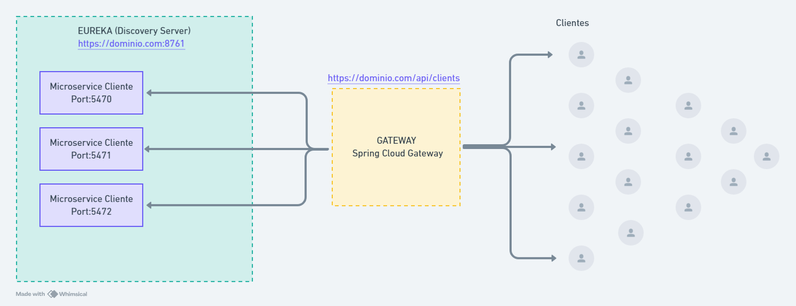

 


# Projeto de Microserviços para Registro de Clientes, Emissão de Cartão de Crédito, Análise de Crédito e Gestão de Crédito

## Visão Geral

Este projeto é uma aplicação baseada em microserviços projetada para lidar com vários aspectos da gestão de clientes e serviços de crédito. As funcionalidades principais incluem registro de clientes, emissão de cartões de crédito, análise de crédito e gestão de crédito. O projeto utiliza o Spring Cloud Eureka para descoberta de serviços e o Spring Cloud Gateway para funcionalidades de gateway de API.

## Índice

- [Visão Geral](https://chatgpt.com/c/cc9a9d90-aa23-45f5-ab88-a0ba7ad6a9d1#visão-geral)
- [Arquitetura](https://chatgpt.com/c/cc9a9d90-aa23-45f5-ab88-a0ba7ad6a9d1#arquitetura)
- [Tecnologias Utilizadas](https://chatgpt.com/c/cc9a9d90-aa23-45f5-ab88-a0ba7ad6a9d1#tecnologias-utilizadas)
- [Serviços](https://chatgpt.com/c/cc9a9d90-aa23-45f5-ab88-a0ba7ad6a9d1#serviços)
- [Começando](https://chatgpt.com/c/cc9a9d90-aa23-45f5-ab88-a0ba7ad6a9d1#começando)
- [Configuração](https://chatgpt.com/c/cc9a9d90-aa23-45f5-ab88-a0ba7ad6a9d1#configuração)
- [Uso](https://chatgpt.com/c/cc9a9d90-aa23-45f5-ab88-a0ba7ad6a9d1#uso)
- [Contribuição](https://chatgpt.com/c/cc9a9d90-aa23-45f5-ab88-a0ba7ad6a9d1#contribuição)
- [Licença](https://chatgpt.com/c/cc9a9d90-aa23-45f5-ab88-a0ba7ad6a9d1#licença)

## Diagrama



## Arquitetura

A arquitetura do projeto é baseada em microserviços, onde cada serviço é responsável por um aspecto específico da funcionalidade da aplicação. Os serviços se comunicam entre si através de APIs REST e são registrados no Eureka para descoberta de serviços. O API Gateway lida com o roteamento e fornece um único ponto de entrada para os microserviços.

```

+---------------------+
|    API Gateway      |
+---------+-----------+
          |
+---------v-----------+
|    Eureka Server    |
+---------+-----------+
          |
+---------v-----------+
|  Serviço de Clientes|  ---> Lida com o registro e gestão de clientes
+---------------------+
          |
+---------v-----------+
|  Serviço de Cartões |  ---> Gerencia a emissão de cartões de crédito
+---------------------+
          |
+---------v-----------+
|  Serviço de Análise |  ---> Realiza análise de crédito
+---------------------+
          |
+---------v-----------+
|  Serviço de Gestão  |  ---> Gerencia o crédito geral dos clientes
+---------------------+
```

## Tecnologias Utilizadas

- **Java**
- **Spring Boot**
- **Spring Cloud Eureka**: Para descoberta de serviços
- **Spring Cloud Gateway**: Para gateway de API
- **Spring Data JPA**: Para interações com o banco de dados
- **H2 Database**: Para desenvolvimento e testes
- **Maven**: Para build do projeto e gerenciamento de dependências

## Serviços

### 1. Serviço de Clientes

Lida com o registro e gestão de clientes.

### 2. Serviço de Cartões de Crédito

Gerencia a emissão de cartões de crédito para clientes.

### 3. Serviço de Análise de Crédito

Realiza análise de crédito com base nos dados dos clientes.

### 4. Serviço de Gestão de Crédito

Gerencia o crédito geral dos clientes, incluindo limites e transações.

## Começando

### Pré-requisitos

- JDK 11 ou superior
- Maven 3.6+
- Docker (opcional, para containerização)
