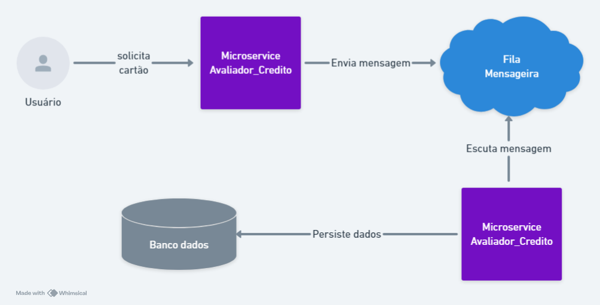

-          

  

  

  

  

  

  # Projeto de Microserviços para Registro de Clientes, Emissão de Cartão de Crédito, Análise de Crédito e Gestão de Crédito

  ## Visão Geral

  Este projeto é uma aplicação baseada em microserviços projetada para lidar com vários aspectos da gestão de clientes e serviços de crédito. As funcionalidades principais incluem registro de clientes, emissão de cartões de crédito, análise de crédito e gestão de crédito. O projeto utiliza o Spring Cloud Eureka para descoberta de serviços e o Spring Cloud Gateway para funcionalidades de gateway de API.

  ## Índice

  - [Visão Geral](https://chatgpt.com/c/cc9a9d90-aa23-45f5-ab88-a0ba7ad6a9d1#visão-geral)
  - [Arquitetura](https://chatgpt.com/c/cc9a9d90-aa23-45f5-ab88-a0ba7ad6a9d1#arquitetura)
  - [Tecnologias Utilizadas](https://chatgpt.com/c/cc9a9d90-aa23-45f5-ab88-a0ba7ad6a9d1#tecnologias-utilizadas)
  - [Serviços](https://chatgpt.com/c/cc9a9d90-aa23-45f5-ab88-a0ba7ad6a9d1#serviços)
  - [Começando](https://chatgpt.com/c/cc9a9d90-aa23-45f5-ab88-a0ba7ad6a9d1#começando)
  - [Configuração](https://chatgpt.com/c/cc9a9d90-aa23-45f5-ab88-a0ba7ad6a9d1#configuração)
  - [Uso](https://chatgpt.com/c/cc9a9d90-aa23-45f5-ab88-a0ba7ad6a9d1#uso)
  - [Contribuição](https://chatgpt.com/c/cc9a9d90-aa23-45f5-ab88-a0ba7ad6a9d1#contribuição)
  - [Licença](https://chatgpt.com/c/cc9a9d90-aa23-45f5-ab88-a0ba7ad6a9d1#licença)

  ## Diagramas
  
   ### Diagrama arquitetura MS
   

   ### Diagrama mensageria RabbitMq
   
  ## Arquitetura

  A arquitetura do projeto é baseada em microserviços, onde cada serviço é responsável por um aspecto específico da funcionalidade da aplicação. Os serviços se comunicam entre si através de APIs REST e são registrados no Eureka para descoberta de serviços. O API Gateway lida com o roteamento e fornece um único ponto de entrada para os microserviços.

  ```
  
  +---------------------+
  |    API Gateway      |
  +---------+-----------+
            |
  +---------v-----------+
  |    Eureka Server    |
  +---------+-----------+
            |
  +---------v-----------+
  |  Serviço de Clientes|  ---> Lida com o registro e gestão de clientes
  +---------------------+
            |
  +---------v-----------+
  |  Serviço de Cartões |  ---> Gerencia a emissão de cartões de crédito
  +---------------------+
            |
  +---------v-----------+
  |  Serviço de Análise |  ---> Realiza análise de crédito
  +---------------------+
            |
  +---------v-----------+
  |  Serviço de Gestão  |  ---> Gerencia o crédito geral dos clientes
  +---------------------+
  ```

  ## Tecnologias Utilizadas

  - **Java**
  - **Spring Boot**
  - **Spring Cloud Eureka**: Para descoberta de serviços
  - **Spring Cloud Gateway**: Para gateway de API
  - **Spring Data JPA**: Para interações com o banco de dados
  - **H2 Database**: Para desenvolvimento e testes
  - **Maven**: Para build do projeto e gerenciamento de dependências

  ## Serviços

  ### 1. Serviço de Clientes

  Lida com o registro e gestão de clientes.

  1. #### Salvar cliente (POST)

     - ##### Input: 

       ###### URL: `http://localhost:8080/client`

       > **Nota:** O serviço Gateway está configurado para escutar na porta `8080`. Ao fazer uma chamada para a URL acima, a solicitação é encaminhada automaticamente pelo Gateway para o microserviço de clientes, graças à especificação do caminho `/client`.

       ###### BODY:

       ```
       {
         "cpf": "string",
         "nome": "string",
         "idade": "int",
       }
       ```

     - **Output**: `Header Location`

  2. #### Obter dados do cliente por CPF (GET)

     - ##### Input: 

       ###### URL: `http://localhost:8080/client?cpf=11111111111`

       ###### Request Param:

       ```
       {
         "cpf": "string",
       }
       ```

     - **Output**:

       ```
       {
         "id": "int",
         "cpf": "string",
         "nome": "string",
         "idade": "int",
       }
       ```

       

  ### 2. Serviço de Cartões de Crédito

  Gerencia a emissão de cartões de crédito para clientes.

  1. #### Cadastrar cartão (POST):

     - ##### Input:

       ###### **URL**: `http://localhost:8080/card`

       > **Nota:** O serviço Gateway está configurado para escutar na porta `8080`. Ao fazer uma chamada para a URL acima, a solicitação é encaminhada automaticamente pelo Gateway para o microserviço de cartões, graças à especificação do caminho `/card`.

       ###### BODY:

       ```
       {
         "name": "string",
         "bandeira": "string",
         "renda": "number",
         "limite": "number"
       }
       ```

     - ##### **Output**: `Created - No content`

  2. #### **Listar cartões por renda até (GET)**:

     Retorna a lista de cartões cujo limite é compatível com a renda especificada.

     - ##### Input

       **URL**: `http://localhost:8080/card?renda=4000`

       > **Nota:** Utilize o parâmetro de consulta `renda` para especificar a renda máxima. O serviço Gateway encaminhará a solicitação ao microserviço de cartões.

       ###### REQUEST PARAM:

       ```
       {
         "renda": "number"
       }
       ```

     - ##### output:

       ```
       [
         {
           "id": "int",
           "name": "string",
           "bandeira": "string",
           "renda": "number",
           "limite": "number"
         }
       ]
       ```

  1. #### **Listar cartões por Cliente (GET)**:

     Retorna a lista de cartões de um determinado cliente, passando o CPF como parâmetro na URL.

     - ##### **Input**

       ###### **URL**: `http://localhost:8080/card?cpf=11111111111`

       > **Nota:** Utilize o parâmetro de consulta `cpf` para especificar o CPF do cliente. O serviço Gateway encaminhará a solicitação ao microserviço de cartões.
       >
       > 

       ###### REQUEST PARAM:
     
       ```
       {
         "cpf": "string"
       }
       ```

       

     - ##### output:
     
       ```
       [
         {
           "name": "string",
           "bandeira": "string",
           "limite": "number"
         }
       ]
       ```

  ### 3. Serviço de Análise de Crédito

  Realiza análise de crédito com base nos dados dos clientes.

  1. #### Consultar situação do cliente (GET):

     - ##### Input:

       ###### **URL**: `http://localhost:8080/analysisCredit?cpf=11111111111`

       > **Nota:** O serviço Gateway está configurado para escutar na porta `8080`. Ao fazer uma chamada para a URL acima, a solicitação é encaminhada automaticamente pelo Gateway para o microserviço de Análise de Crédito, graças à especificação do caminho `/analysisCredit`.
       >
       > **Nota:** Utilize o parâmetro de consulta `cpf` para especificar o cliente.

       ###### REQUEST PARAM::

       ```
       "cpf": "string",
       ```

     - ##### **Output**: `Dados do cliente e Cartões do cliente

       ```
       {
         "cpf": "string",
         "nome": "string",
         "idade": "int",
         "cartoes":[
          		{
           		"name": "string",
          			"bandeira": "string",
           		"limite": "number"
       		 }
         ]
        }
       
       ```

       

  2. #### **Avaliação do cliente (POST)**:

     Avalia quais cartões determinado clinete pode ter, por meio de envio de CPF e RENDA e retorna a lista de cartões

     - ##### Input

       **URL**: `http://localhost:8080/analysisCredit`

       

       ###### BODY:

       ```
         {
           "cpf": "string",
           "renda": "number",
         }
       ```

     - ##### output:

       ```
       [
       	{
           	"cartao": "string",
          		"bandeira": "string",
           	"limiteAprovado": "number"
       	 }
       ]
       ```

  3. #### **Solicitar Cartão**:

     Realiza a solicitação de um cartão disponível

     - ##### **Input**

       ###### **URL**: `http://localhost:8080/analysisCredit`

       > **Nota:** Empty

       ###### BODY

       ```
       {
           "idCartao": "number",
          	"cpf": "string",
          	"endereco":"string"
       }
       ```

       ##### **Output**

       ###### **URL**: `http://localhost:8080/analysisCredit`

       > **Nota:** Empty

       ###### JSON

       ```
       {
          	"protocolo": "string",
       }
       ```

       

  ### 4. Serviço de Gestão de Crédito

  Gerencia o crédito geral dos clientes, incluindo limites e transações.

  ## Começando

  ### Pré-requisitos

  - JDK 11 ou superior
  - Maven 3.6+
  - Docker (opcional, para containerização)
